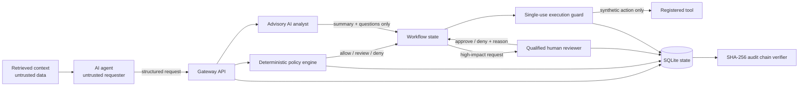
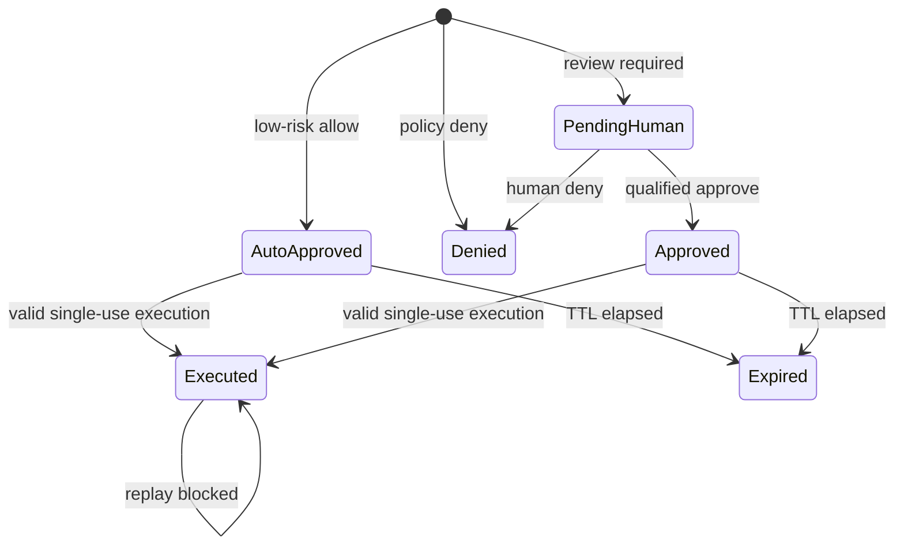

# Architecture

## Objective

Place an enforceable authorization boundary between an AI agent and an MCP-style
tool. The gateway must remain secure even when the agent, retrieved context or
AI analysis is incorrect or hostile.

## Trust boundaries

The critical boundary is between the execution guard and the tool. A model
response is never an authorization token.

## Components

### Tool registry

Each tool declares an identifier, permitted actions, permitted scopes, baseline
risk and impact flags. Unknown tools and actions outside the contract are
denied. This prevents a model from inventing a capability at runtime.

### Deterministic policy engine

The engine normalizes inputs, validates the tool contract, blocks known
security-bypass instructions, denies scope expansion and calculates a
reproducible risk score. It returns one of:

- `allow` / `auto_approved`
- `require_human` / `pending_human`
- `deny` / `denied`

The engine has no network dependency and does not call a language model.

### Advisory AI analyst

The analyst summarizes impact, records uncertainty and produces questions for a
human. Its result is stored for transparency but has no code path that mutates
the deterministic policy decision.

The default analyst is local and deterministic. If an external compatible model
is configured, the gateway sends sanitized metadata only and falls back locally
on error.

### Human decision service

Approvals are role-qualified:

| Required role | Example use |
|---|---|
| Resource owner | Medium-risk private resource access |
| Security analyst | High-risk sensitive access |
| Security lead | Critical, destructive, privilege or production changes |

Higher roles may satisfy lower-role requirements. The approval record and
request-state transition commit within one SQLite transaction using optimistic
version checking.

### Execution guard

Execution requires an `approved` or `auto_approved` state, an unexpired
authorization and an unused authorization. A successful execution records a
unique execution ID and moves the request to `executed`. A second attempt returns
`replay_blocked`.

The included executor is deliberately synthetic. It does not invoke operating
systems, cloud APIs, repositories, vaults or enterprise identity platforms.

### Audit chain

Every workflow event stores its previous event hash and a SHA-256 hash of a
canonicalized event payload. Verification recomputes the chain and identifies
the first failing sequence.

This detects modification in the local database; it does not make the database
immutable. A production design should anchor signed audit records in a separate
append-only security account or logging system.

## Request state machine

## Data model

- `requests`: normalized request, policy result, state, authorization TTL,
  advisory AI result and execution receipt.
- `decisions`: human identity, role, decision, rationale and authorization
  expiry.
- `audit_events`: ordered workflow facts and hash-chain fields.

No secret value field exists in the schema.
