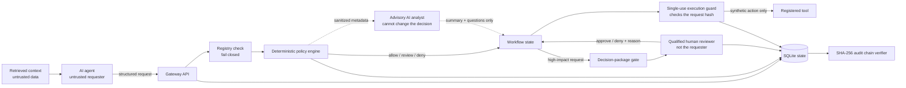
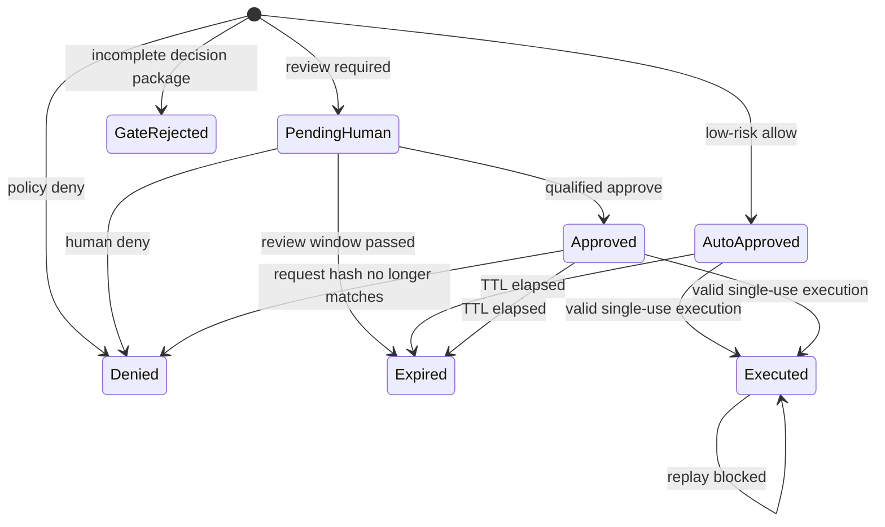

# Architecture

## Objective

Place an enforceable authorization boundary between an AI agent and an MCP-style
tool. The gateway must remain secure even when the agent, retrieved context or
AI analysis is incorrect or hostile.

## Trust boundaries

```mermaid
flowchart LR
    A[AI agent<br/>untrusted requester] -->|structured request| B[Gateway API]
    C[Retrieved context<br/>untrusted data] --> A
    B --> R[Registry check<br/>fail closed]
    R --> D[Deterministic policy engine]
    D -. sanitized metadata .-> E[Advisory AI analyst<br/>cannot change the decision]
    D -->|allow / review / deny| F[Workflow state]
    E -.->|summary + questions only| F
    F -->|high-impact request| PG[Decision-package gate]
    PG --> G[Qualified human reviewer<br/>not the requester]
    G -->|approve / deny + reason| F
    F --> H[Single-use execution guard<br/>checks the request hash]
    H -->|synthetic action only| I[Registered tool]
    B --> J[(SQLite state)]
    D --> J
    G --> J
    H --> J
    J --> K[SHA-256 audit chain verifier]
```

The critical boundary is between the execution guard and the tool. A model
response is never an authorization token. The same flow, with the numbered steps
and one guardrail each, is animated in the Architecture section of the app and
written out in [Workflows](WORKFLOWS.md).

## Components

### Tool registry

Each tool declares an identifier, permitted actions, permitted scopes, baseline
risk and impact flags. Unknown tools and actions outside the contract are
denied. This prevents a model from inventing a capability at runtime.

### Deterministic policy engine

The engine validates the shape and size of the input, normalizes it, then checks
in order: required fields, the tool (own-property lookup), the action, the
resource type, that at least one scope is named, that every scope is in the
contract, and the injection scan. Only then does it score. Every deny carries a
`denyCode` and a `stage` (`registry` or `policy`). The score uses the tool's
baseline, a data classification that can only be raised above the tool's
registered sensitivity, production exposure, requested scopes, a short
justification and the tool's impact flags. Self-reported `existingScopes` do not
reduce it. It returns one of:

- `allow` / `auto_approved`
- `require_human` / `pending_human`
- `deny` / `denied`

The engine has no network dependency and does not call a language model.

### Advisory AI analyst

The analyst summarizes impact, records uncertainty and produces questions for a
human. Its result is stored for transparency but has no code path that mutates
the deterministic policy decision. The decision-package gate does not read it
either: it reads the request.

The default analyst is a fixed set of rules. It is a simulation of an analyst,
and each record says so (`provider: offline-deterministic`, `modelCalled:
false`). If an external compatible model is configured, the gateway sends a fixed
list of metadata fields (never context, arguments or the resource path), redacts
credential-shaped text from the justification, accepts only four typed fields
back, and falls back to the rules on error.

### Human decision service

Approvals are role-qualified:

| Required role | Example use |
|---|---|
| Resource owner | Medium-risk private resource access |
| Security analyst | High-risk sensitive access |
| Security lead | Critical, destructive, privilege or production changes |

Higher roles may satisfy lower-role requirements. Any decision needs a role that
can review (not `viewer`). The requester cannot approve its own request, in any
capitalization. The approval record and request-state transition commit within
one SQLite transaction using optimistic version checking, and the database allows
one decision per request. A pending request older than 240 minutes expires.

Each approval is bound to a SHA-256 of the policy version, requester, tool,
action, resource, environment, classification, sorted scopes, arguments,
justification and context.

### Execution guard

Execution requires an `approved` or `auto_approved` state, an unexpired
authorization and an unused authorization. Before consuming, the guard recomputes
the request hash and compares it with the policy result and the human decision;
a mismatch revokes the authorization. If the caller presents a hash or identity,
those must match too. The expiry check fails closed. A successful execution
records a unique execution ID and moves the request to `executed` inside one
transaction with a version check, so of two racing callers one wins. A second
attempt returns `replay_blocked`. Blocked attempts are audited.

The included executor is deliberately synthetic. It does not invoke operating
systems, cloud APIs, repositories, vaults or enterprise identity platforms.

### Audit chain

Every event stores its sequence number, its previous event hash and a SHA-256 of
the canonical form (sorted keys, no whitespace) of sequence, event id, request
id, type, actor, payload, previous hash and timestamp. Verification walks the
events and checks sequence continuity, the link, the hash and, when
`AUDIT_HMAC_KEY` is set, an HMAC of each hash. It reports the first failing
event and why.

What this detects: edited fields, deleted middle events, reordering and
renumbering. What it does not: removal of the newest events (pass a saved anchor
to detect that), or a writer who rebuilds the whole chain when no key is
configured. The browser demo has no key. A production design should sign records
and anchor the head in a separate append-only security account or logging
system.

## Request state machine

```mermaid
stateDiagram-v2
    [*] --> AutoApproved: low-risk allow
    [*] --> PendingHuman: review required
    [*] --> Denied: policy deny
    [*] --> GateRejected: incomplete decision package
    PendingHuman --> Approved: qualified approve
    PendingHuman --> Denied: human deny
    PendingHuman --> Expired: review window passed
    Approved --> Denied: request hash no longer matches
    AutoApproved --> Executed: valid single-use execution
    Approved --> Executed: valid single-use execution
    AutoApproved --> Expired: TTL elapsed
    Approved --> Expired: TTL elapsed
    Executed --> Executed: replay blocked
```

## Data model

- `requests`: normalized request, arguments, request hash, policy result, state,
  authorization TTL, advisory AI result and execution receipt.
- `decisions`: human identity, role, decision, rationale, request hash and
  authorization expiry. One per request.
- `audit_events`: ordered workflow facts, hash-chain fields and the optional
  HMAC signature.

Databases created before the hash and signature columns existed are upgraded in
place when the store opens.

No secret value field exists in the schema.

## Browser demo and the server copy

`src/demo/` carries browser versions of the policy, scenarios, analyst and
service. `policy.js` and `scenarios.js` are byte-identical to the server files
apart from a header comment. `service.js` is generated from `server/service.js`
by `node scripts/sync-demo-service.mjs`. `tests/parity.test.js` fails if any of
that drifts and also runs every scenario and 3000 generated requests through
both copies.

## Limits and honest caveats

- Data is synthetic and the executor is simulated.
- Reviewer identity and role are supplied by the caller.
- The analyst is rule-based unless a model is configured.
- Injection detection is a phrase heuristic with known gaps.
- The audit chain is tamper-evident, not tamper-proof (see above).
- The demo state lives in browser localStorage.
- This is not a production control.
